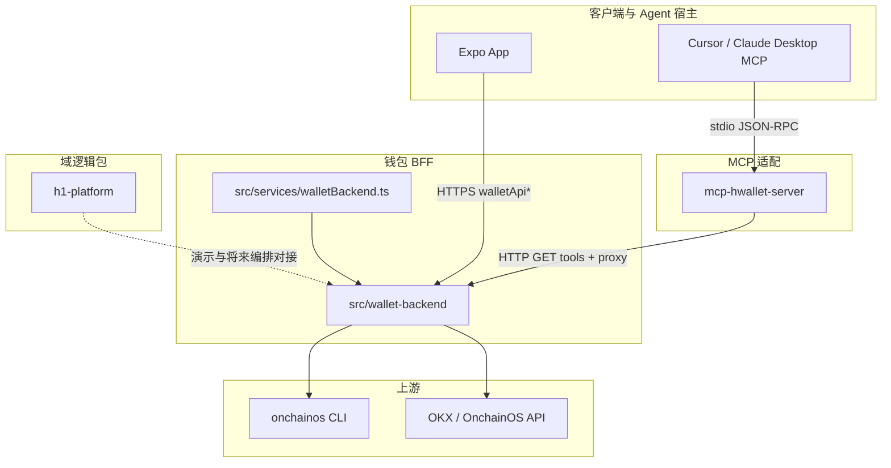

# H Wallet 仓库结构总览

本文描述 **999-1** monorepo 内与「App / BFF / 域平台 / MCP / 运维」相关的目录与数据流，便于 onboarding 与扩展。产品级域模型与 REST 约定见同目录 **`H_WALLET_PRODUCT_DEV_REQUIREMENTS.md`**。  
**分阶段推进与跨会话备忘（钱包 BFF / 运维）**：见 **`WALLET_BFF_PHASE_PLAN.md`**。

---

## 1. 逻辑分层（自顶向下）



| 层 | 路径 | 职责 |
|----|------|------|
| **App（Expo）** | `src/screens/`、`src/services/walletApi*.ts`、`src/api/providers/okx/` | UI、会话、调用自有 BFF；链上客户端经 `okxOnchainClient` → `onchain/` |
| **BFF** | `src/wallet-backend/`、`src/services/walletBackend.ts` | HTTP：鉴权、钱包/DEX/AI/运维；`h1-capabilities.ts` 定义 **`H1.skill.*`** |
| **MCP 适配** | `mcp-hwallet-server/` | stdio MCP：启动时拉 **`GET /api/meta/capabilities`**，工具调用 **HTTP 代理**到 BFF |
| **域平台（与 RN 解耦）** | `h1-platform/` | integration / orchestration 等；Vitest；**尚未**与 BFF 全量硬绑 |
| **人类运维台** | `ops-console/`（HTML 模板）、`/ops`（**服务端组装**）、`/api/admin/*` | 模板 + Admin API（`HWALLET_OPS_ADMIN_TOKEN`） |
| **Agent 技能说明** | `.agents/skills/` | Cursor Agent 路由与 OKX 能力说明（非 MCP 协议本身） |

---

## 2. 目录树（核心部分）

```text
999-1/
├── docs/
│   ├── H_WALLET_PRODUCT_DEV_REQUIREMENTS.md   # 产品/域模型/MCP 命名约定
│   └── H_WALLET_REPO_STRUCTURE.md             # 本文件
├── h1-platform/                 # @hwallet/h1-platform — 域逻辑与测试
├── mcp-hwallet-server/          # @hwallet/mcp-hwallet-server — MCP stdio 服务
├── ops-console/                 # 运维台 HTML 模板（由 BFF 注入路由表后输出 /ops）
├── src/
│   ├── api/
│   │   ├── contracts/           # IH_* 网关契约
│   │   ├── gateway.ts           # OKX Provider 聚合（App 内 V5/V6 抽象）
│   │   └── providers/okx/
│   │       ├── onchain/         # hwalletBackendFetch、client、types
│   │       └── okxOnchainClient.ts  # barrel
│   ├── services/
│   │   ├── walletBackend.ts     # BFF 进程入口 → wallet-backend/http-server
│   │   ├── walletApiCore.ts     # API Base URL
│   │   ├── walletApiHttp.ts     # fetch 工具
│   │   ├── walletApi.ts         # 会话与业务 API
│   │   ├── aiChat.ts            # 意图识别实现（BFF ai-handlers 调用）
│   │   └── core/
│   │       ├── claudeAI.ts      # App 侧 askClaude → /api/ai/intent
│   │       └── chatOrchestrator.ts
│   └── wallet-backend/          # BFF 实现（模块化 + routes）
│       ├── h1-capabilities.ts   # H1.skill.* 注册表（单一事实来源）
│       ├── http-server.ts
│       ├── routes/
│       │   ├── index.ts         # dispatch：Meta → Admin → Auth → Wallet → DEX → AI → Health
│       │   ├── meta-routes.ts # GET /api/meta/capabilities
│       │   └── …
│       └── README.md
├── ecosystem.config.cjs         # PM2：wallet-backend
└── package.json                 # 根脚本：dev:wallet-backend、mcp:hwallet、bootstrap:subpkgs
```

---

## 3. 关键入口与脚本

| 脚本 / 入口 | 说明 |
|-------------|------|
| `npm run dev:wallet-backend` | `tsx src/services/walletBackend.ts`，默认 `WALLET_PORT`（如 3100） |
| `npm run bootstrap:subpkgs` | 安装 `h1-platform` + `mcp-hwallet-server` 依赖（子包无 hoist 进根 node_modules） |
| `npm run test:h1` | 仅 `h1-platform` Vitest |
| `npm run test:services` | `src/services/**/*.test.ts`（如 `intentNormalize`） |
| `npm run mcp:hwallet` | 安装 MCP 子包依赖后以 `tsx` 启动 stdio MCP |
| `npm run mcp:hwallet:build` | 编译 `mcp-hwallet-server/dist`（供 `node dist/cli.js`） |

---

## 4. 能力发现与 MCP 对齐

1. **源码**：`src/wallet-backend/h1-capabilities.ts` 维护 `H1_CAPABILITY_REGISTRY`。
2. **HTTP**：`GET /api/meta/capabilities` 返回 `tools[]`（`name` / `description` / `inputSchema` / `_meta.http`）。可选 **`HWALLET_META_CAPABILITIES_TOKEN`** + 请求头 **`X-Hwallet-Meta-Token`** 限制未授权拉取。
3. **MCP**：`mcp-hwallet-server` 启动时拉取上项并 `registerTool`；执行时 **proxy** 到 BFF（`hwallet_session` / `HWALLET_SESSION_TOKEN`）；若 BFF 启用 meta token，在 MCP 环境配置同名变量。
4. **BFF 治理**：`HWALLET_CORS_ORIGINS` 白名单、`HWALLET_MAX_JSON_BODY_BYTES` 413、`/api/ai/*` POST 简单限流、日志中的 **`X-Request-Id`**。

后续若在网关加 **`/api/v1/...`** 版本前缀，应 **先改注册表与路由**，再同步 MCP 文档示例。

---

## 5. 对话意图 vs 网关 `H_Intent`（避免混为一谈）

- **会话内用户话 → `AIIntent`**：`src/services/intentNormalize.ts` 为 **单一事实来源**——`CHAT_INTENT_ACTIONS` 白名单、`sanitizeIntentPayload`、本地关键词 **`localRuleIntent`**（BFF 的 `aiChat` 与 App 的 `askClaude` 无网/失败路径 **共用**，避免两套正则漂移）；LLM 的 `INTENT_SYSTEM_PROMPT` 中 `action` 枚举由 **`CHAT_INTENT_ACTION_PROMPT_LITERAL`** 生成，与代码一致。
- **网关 `H_Intent` + `OkxH_IntentRouter`**：`src/api/gateway.ts` 内 **OKX Provider 调度抽象**，与上一条 **不是同一入口**；未接到「用户自然语言」直连映射。长期若要把对话与 MCP 合一，应让编排产出 **`H1.skill.*`**（见 `h1-capabilities.ts`），而不是在 `H_Intent` 与 `AIIntent` 之间手写第二套枚举。

---

## 6. 相关文档

- `src/wallet-backend/README.md` — BFF 模块清单与 MCP 指针  
- `mcp-hwallet-server/README.md` — 环境变量与 Cursor `mcp.json` 示例  
- `h1-platform/README.md`（若存在）— 域包边界  
